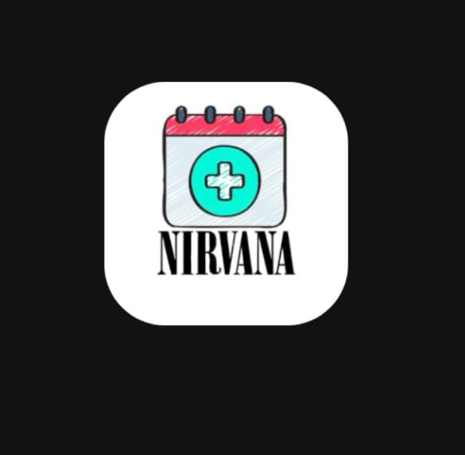

# NIRVANA----Medical-Appointment-Booking-App 🏥


Your one-stop solution for hassle-free medical appointment booking! 💙

🌟 Overview
NIRVANA is a modern and intuitive Medical Appointment Booking App that connects patients with healthcare professionals effortlessly. Our goal is to reduce wait times, enhance accessibility, and make the healthcare experience smoother for everyone.

✅ Easy Appointments - Book, reschedule, or cancel in seconds.
✅ Find the Best Doctors - Browse expert profiles with specialties.
✅ Smart Notifications - Get timely reminders for your appointments.
✅ Admin Controls - Manage users, doctors, and appointments seamlessly.

🛠️ Tech Stack
🔹 Frontend: HTML, CSS, JavaScript
🔹 Backend: Node.js, Express.js
🔹 Database: MongoDB
🔹 Authentication: JSON Web Tokens (JWT)
🔹 Deployment: Docker, Kubernetes

🚀 Quick Start
1️⃣ Clone the Repository
```bash
    git clone https://github.com/Sushil2k4/NIRVANA----Medical-Appointment-Booking-App.git
    cd NIRVANA----Medical-Appointment-Booking-App
```
2️⃣ Install Dependencies
```bash
    npm install
```
3️⃣ Set Up Environment Variables
Create a .env file in the root directory and add:
```bash
    PORT=3000
    MONGODB_URI=your_mongodb_connection_string
    JWT_SECRET=your_jwt_secret_key
```
4️⃣ Start the App
```bash 
    npm start
```
🎉 Open http://localhost:3000 and start booking appointments!

📌 How It Works
👤 Patients - Sign up, browse doctors, and schedule appointments.
🩺 Doctors - Manage availability, accept/cancel bookings, and view patient info.
🛡️ Admins - Oversee users, doctors, and system settings.